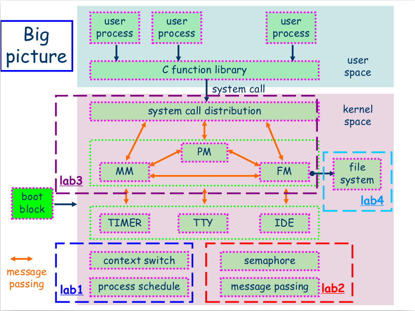

[](https://travis-ci.org/zzt93/os-lab1)

# os-lab1
os-lab1

Try to learn os by lab

------------------------------

## Aim:



## Running requirement
- make  
- qemu( I am using `qemu-system-i386` in makefile)  
- gcc  

----------------------

Sep 26 2015 update:

## The functionalities that I have already implemented:

### Mis
- printk -- printf in kernel  
- kmalloc -- malloc in kernel -- using next-fit algorithm  
- the key press interrupt handler  
- a simple maze game running without os  
- the context switch between threads  
- the creation of kernel thread  
- the schedule of thread -- now using Round-Robin algorithm  
- the sleep and wake_up of thread  
- the semaphore(P&V) and lock(cli&sti) to slove critical section  
- the send and receive message between threads  -- send it asynchronized and will always succeed; receive is synchronized and may be blocked   
- add timer-- clock diver, ide-- hard disk driver, tty -- terminal driver  
- very very simple file system -- name is number, size is fixed  
- create user process  
- using page dynamic allocation  -- using bit-map algorithm  
- add page protection  
- put user in ring3  
- wait(int second) -- system call  
- random number  
- non-blocked timer -- used to make a process run specific seconds, i.e. counting its running time  
- LCM and GCD  

### process
- fork a process  
- exec a command  
- exit a user process  
- waitpid  
- a simple shell  

### file system
- upgrade file system: change file system name to string; size is variable  
- create a file(file name max is 28 bytes @see f_dir.h)  
- make a directory(directory depth max is 16 @see f_dir.h)  
- delete a file  
- delete a directory  
- change current working directory  
- list files under a folder  
- open a file  
- close a file  
- read a file  
- write a file  
- lseek a file: i.e. change the cursor for reading/writing  

### shell utility:
- cd
- pwd
- ls
- echo
- echo arguments and wait 5 seconds


### Implement some ADT:  
- circular queue  
- [BST](docs/ADT/BST.md)  
- [map](docs/ADT/map.md)  
- linked-list  
- bit map  
- dynamic allocated bit map( using kmalloc)  
- [heap](docs/ADT/heap.md)

---------------------

[some important implementation details](docs/internal.md)

-----------------

## Lessons:
- the adt itself may not to be synchronized, the user choose whether to synchronize it, like `Vector and ArrayList`?  
- can add NOINTR to make sure user add synchronization if necessary  
- the adt seems should not using semaphore and P&V for concurrent use, for it may used in irq which may cause deadlock  

- put the original global variable to parameter can better re-use some data structure.(ListHead)
- using macro when need different type(Tree<>)
- using special name convention when implement data structure, e.g. `_bitmap_array` to avoid name collision  
- using `name##_adt` can better reuse adt  

- design an error return system between 'client' and 'server'(in os is 'application programmer' and 'os kernel programmer')
	- `enum`: not a simple `FAIL` and `SUCC` but `no such directory or file`, `Segmentation fault`.
	- `struct`: a int indicate state, and a string indicate error message.

- if fail to allocate some resources when allocating a serial of resources,  
	remember to free already allocated resources.  

- avoid using `void *` for it may hide some bugs because the implicit conversion of different type of pointers.  

- if not sure what type should use, may use typedef/macro type like `xxx_t` to make it easy to change
- c like interface:
```
struct xxx {
/* procedure handles */
	int	(*if_init)		/* init routine */
		__P((int));
	int	(*if_output)		/* output routine (enqueue) */
		__P((struct ifnet *, struct mbuf *, struct sockaddr *,
		     struct rtentry *));
	int	(*if_start)		/* initiate output routine */
		__P((struct ifnet *));
	int	(*if_done)		/* output complete routine */
		__P((struct ifnet *));	/* (XXX not used; fake prototype) */
	int	(*if_ioctl)		/* ioctl routine */
		__P((struct ifnet *, u_long, caddr_t));
	int	(*if_reset)
		__P((int));		/* new autoconfig will permit removal */
	int	(*if_watchdog)		/* timer routine */
		__P((int));
};
```
- c like abstract class:
```
The ifnet and ifaddr structures contain general information applicable to all network interfaces
and protocol addresses. To accommodate additional device and protocol-specific information, each
driver defines and each protocol allocates a specialized version of the ifnet and ifaddr
structures. These specialized structures always contain an ifnet or ifaddr structure as their first
member so that the common information can be accessed without consideration for the additional
specialized information.
```

## Debug
- minimize the code where bug might in by comment other parts
- rational analysis about who can change it
- gdb: watch and breakpoint
- print more if bug is related to interrupt and not so easy to repeat
- exceptions like 14, 13: 1. printed stack info 2. error code with i386 manual


### TODO
- user process memory allocation: heap & malloc
- load program when it needs -- 缺页
- command: mkdir, rm, touch, >, vi
- network: tcp/ip, socket -- ping, traceroute
  - loopback interface
  - driver code
  - kernel code: protocol impl
  - system call
  - command: ping, traceroute


#### Opt
- kmalloc: not allocate small and large memory request on same block of memory -- avoid memory fragmentation
