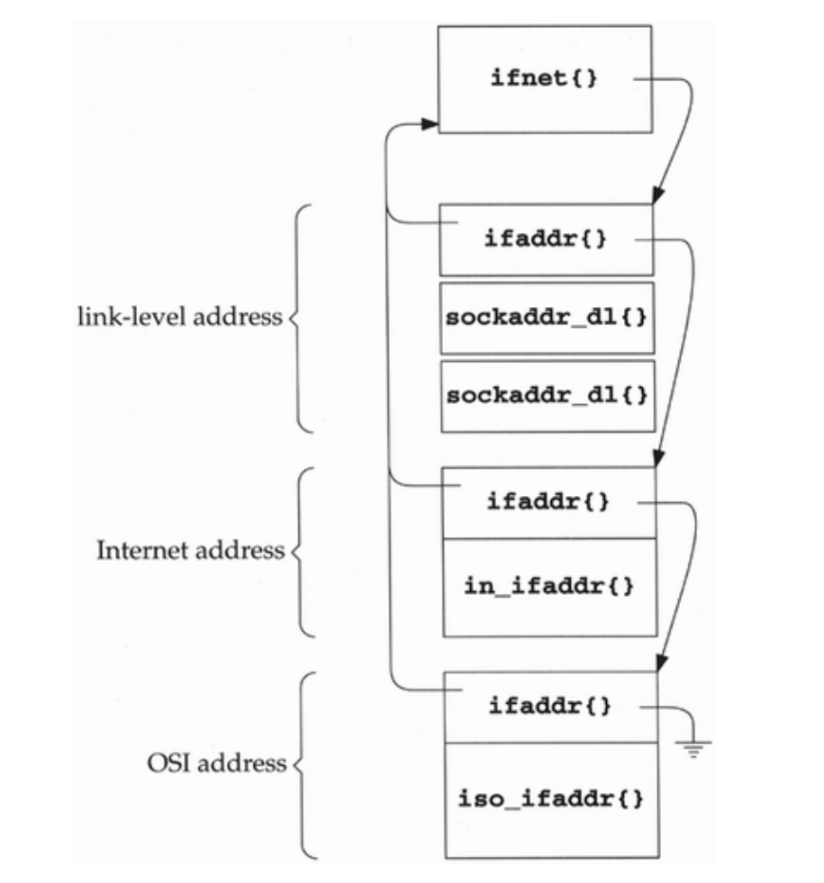

## 1.6 System Calls and Library Function
From an implementor's point of view, the distinction between a system call and a library function is fundamental

- re-design my system call and library function?


## 1.7 Network Implementation Overview

- The socket layer is a protocol-independent interface to the protocol-dependent layer below.All system calls start at the protocol-independent socket layer. For example, the protocol-independent code in the socket layer for the bind system call comprises a few dozen lines ofcode: these verify that the first argument is a valid socket descriptor and that the secondargument is a valid pointer in the process. The protocol-dependent code in the layer below isthen called, which might comprise hundreds of lines of code.
- The protocol layer contains the implementation of the four protocol families that wementioned earlier (TCP/IP, XNS, OSI, and Unix domain). Each protocol suite may have itsown internal structure, which we don't show in Figure 1.3. For example, in the Internetprotocol suite, IP is the lowest layer (the network layer) with the two transport layers (TCPand UDP) above IP.
- The interface layer contains the device drivers that communicate with the network devices.

## 1.8 Descriptors

 - The call to socket by our process ends up allocating the lowest unused descriptor (3 in our example). This descriptor is used by the process in all subsequent system calls that refer to this socket.
 - The following kernel structures are allocated and linked together: a file structure of type DTYPE_SOCKET, a socket structure, and an inpcb structure. Lots of initialization is performed on these structures that we don't show: the file structure is marked for read and write (since the call to socket always returns a descriptor that can be read or written), the default sizes of the input and output buffers are set in the socket structure, and so on.
 - We showed non socket descriptors for our standard input, output, and error to show that all descriptors end up at a file structure, and it is from that point on that differences appear between socket descriptors and other descriptors.

## 1.9 Mbufs (Memory Buffers) and Output Processing

- sendto:One of the first things done by the socket layer for this system call is to verify that these arguments are valid (i.e., the pointer points to a piece of memory in the address space of the process)
- then copy the socket addressstructure into an mbuf
- the socket layer copies the data buffer specified in the call to sendto into one or more mbufs
- the protocol layer corresponding to the socket descriptor (a UDP socket) is called.
- The UDP output routine then fills in the UDP header and as much of the IP header as it can. Forexample, the destination address in the IP header can be set, but the IP checksum will be left for the IPoutput routine to calculate and store.
- The UDP checksum is calculated and stored in the UDP header
- The IP output routine fills in the remaining fields in the IP header including the IP checksum,determines the outgoing interface to which the datagram should be given (this is the IP routingfunction), fragments the IP datagram if necessary, and calls the interface output function.
- The first function of the Ethernet output function is to convert the 32-bit IP address into its corresponding 48-bit Ethernet address -- ARP
- The Ethernet output routine then prepends a 14-byte Ethernet header to the first mbuf in the chain,
  immediately before the IP header


## 1.10 Input Processing

Input processing is different from the output processing just described because the input is asynchronous. Input processing is different from the output processing just described because the input is asynchronous.

- The Ethernet device receive frame, read the destination address and determine whether to keep the remaining IP packet
- The Ethernet device driver processes the interrupt and, assuming it signifies a normal receive-complete condition, the data bytes are read from the device into an mbuf chain.
- The device driver passes the mbuf to a general Ethernet input routine which looks at the type field in the Ethernet frame to determine which protocol layer should receive the packet
- In this example, the type field will specify an IP datagram, causing the mbuf to be added to the IP input queue.
- The IP input routine verifies the IP header checksum,
  - processes any IP options,
  - verifies that the datagram was delivered to the right host (by comparing thedestination IP address of the datagram with the host's IP addresses),
  - and forwards the datagram if thesystem was configured as a router and the datagram is destined for some other IP address.
  - If the IPdatagram has reached its final destination, the protocol field in the IP header specifies which protocol'sinput routine is called: ICMP, IGMP, TCP, or UDP
- The UDP input routine verifies the fields in the UDP header (the length and optional checksum) and then determines whether or not a process should receive the datagram
  - A process can receive all datagrams destined to a specified UDP port, or the process can tell the kernel to restrict the datagrams it receives based on the source and destination IP addresses and source and destination port numbers
- In our example, the UDP input routine starts at the global variable udb (Figure 1.5) and goes through the linked list of UDP protocol control blocks, looking for one with a local port number ( inp_lport ) that matches the destination port number of the received UDP datagram.
- inp_socket member of this PCB points to the corresponding socket structure, allowing the received data to be queued for the correct socket
- Our process has been asleep in the kernel, blocked in its call to recvfrom, and the process now wakes up


In our example program we never specify the local port number for our application. We'll see in Exercise 23.3 that a side effect of writing the first UDP datagram to a socket that has not yet bound a local port number is the automatic assignment by the kernel of a local port number (termed an ephemeral port) to that socket. That's how the inp_lport member of the PCB for our socket gets set to some nonzero value.

# Chapter 2 Mbufs

- use linked list like structure to facilitate memory management: reduce copy

## 2.1 Introduction

Networking protocols place many demands on the memory management facilities of the kernel. These demands include easily manipulating buffers of varying sizes, prepending and appending data to the buffers as the lower layers encapsulate data from higher layers, removing data from buffers (as headers are removed as data packets are passed up the protocol stack), and minimizing the amount of data copied for all these operations. The performance of the networking protocols is directly related to the memory management scheme used within the kernel.

## 2.4 mbuf Structure

M_EOR is set in an mbuf containing the end of a record. The Internet protocols (e.g., TCP) never set this flag, since TCP provides a byte-stream service without any record boundaries. The OSI and XNS transport layers, however, do usethis flag. We will encounter this flag in the socket layer, since this layer is protocol independent and handles data to and from all the transport layers.

## 2.6 `m_devget` and `m_pullup` Functions

- m_devget leaves 16 bytes unused at the beginning of the mbuf. Although the 14-byteEthernet header is not stored here, room is allocated for a 14-byte Ethernet header on output,should the same mbuf be used for output. We'll encounter two functions that generate aresponse by using the received mbuf as the outgoing mbuf: icmp_reflect andtcp_respond.
- The reason 16 bytes are allocated, and not 14, is to have the IP header longword aligned in the mbuf.

## 2.8 Summary of Net/3 Networking Data Structures

For a record-based protocol, such as UDP, we can encounter multiple records per queue, but for a protocol such as TCP that has no record boundaries, we'll find only a single record (one mbuf chain possibly consisting of multiple mbufs) per queue.

## 2.9 m_copy and Cluster Reference Counts

An additional advantage with clusters is being able to share a cluster between multiple mbufs. We encounter this with TCP output and the m_copy function, but describe it in more detail now.

In our UDP example in Section 1.9, UDP took the mbuf chain containing the datagram, prepended an mbuf for the protocol headers, and passed the chain to IP output. UDP did not keep the mbuf in its send buffer. TCP cannot do this since TCP is a reliable protocol and it must maintain a copy of thedata that it sends, until the data is acknowledged by the other end.

## Exercises
### 2.1 Because cluster is no need to be copied, it will be shared across different mbuf

### 2.2
- Fail to allocate a mbuf if need a new mbuf to put contiguous bytes
- If the total amount of data in the mbuf chain is less than the requested number of contiguous bytes
- If `len > MHLEN`, i.e. requested len is impossible to fit in a mbuf

### 2.3 Because cluster is shared, it will have to store multiple back pointer if so

### 2.4 Since the size of an mbuf cluster is a power of 2 (typically 1024 or 2048), space cannot be taken within the cluster for the reference count. Obtain the Net/3 sources (Appendix B) and determine where these reference counts are stored.

The following code is from uipc_mbuf.c & mbuf.h
```
union mcluster {
	union	mcluster *mcl_next;
	char	mcl_buf[MCLBYTES];
};
```
```
#define	MCLFREE(p) \
	MBUFLOCK ( \
	  if (--mclrefcnt[mtocl(p)] == 0) { \
		((union mcluster *)(p))->mcl_next = mclfree; \
		mclfree = (union mcluster *)(p); \
		mbstat.m_clfree++; \
	  } \
	)
```

```
/*
 * Finally, allocate mbuf pool.  Since mclrefcnt is an off-size
 * we use the more space efficient malloc in place of kmem_alloc.
 */
mclrefcnt = (char *)malloc(NMBCLUSTERS+CLBYTES/MCLBYTES,
               M_MBUF, M_NOWAIT);
bzero(mclrefcnt, NMBCLUSTERS+CLBYTES/MCLBYTES);
mb_map = kmem_suballoc(kernel_map, (vm_offset_t *)&mbutl, &maxaddr,
               VM_MBUF_SIZE, FALSE);
```

Procedure:
- `mclfree` is empty
- when wants a cluster
  - `mclfree` is linked with some cluster allocated from `mb_map`(a range of virtual space abstraction)
  - update `mclfree` to next cluster pointer and return `mclfree`
  - use `mclrefcnt[mtocl(p)]` reference count of cluster and update it
    ```
      //  convert pointer within cluster to cluster index #
      #define	mtocl(x)	(((u_long)(x) - (u_long)mbutl) >> MCLSHIFT)
    ```
    - mbutl: init as **min address of mb_map represented virtual address**, when the kernel is initialized in the file machdep.c
    - mclrefcnt: allocated when the kernel is initialized in the file machdep.c
    - MCLSHIFT = log(cluster_size)
    - u_long: `typedef unsigned long	u_long;`


# Interface Layer

## 3.6 ifnet and ifaddr Specialization

The ifnet and ifaddr structures contain general information applicable to all network interfacesand protocol addresses. To accommodate additional device and protocol-specific information, eachdriver defines and each protocol allocates a specialized version of the ifnet and ifaddrstructures. These specialized structures always contain an ifnet or ifaddr structure as their firstmember so that the common information can be accessed without consideration for the additional specialized information.



## 3.8 Ethernet Initialization

[qemu add network device](https://en.wikibooks.org/wiki/QEMU/Devices/Network)
```
qemu-system-i386
```
- when no boot img from DVD/CD or ROM,
- iPXE (PCI) start execution and init network devices
- network will be configured by [ipxe](http://ipxe.org)
  - MAC
  - ipv4/v6, gateway

- may need to write different driver code for different machine
  - hp_device